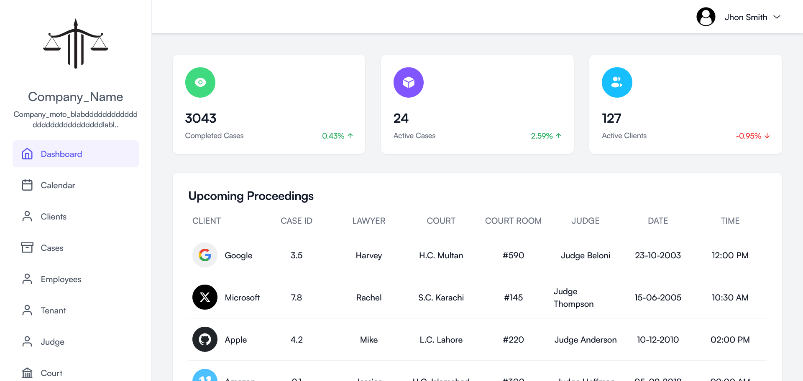

# Multi-Tenant Law Portal

A frontend interface for a **Multi-Tenant Law Portal** designed to help law firms and individual lawyers manage clients, appointments, and internal workflows efficiently, each within their own isolated environment.

> ⚠️ **Disclaimer:** This repository contains **only a portion of the frontend** from a previous version of the full portal. It is shared **with explicit client permission** for portfolio/reference purposes. The complete system (including backend, authentication, and deployment setup) is private due to confidentiality agreements.

## Features

- ✅ **Responsive UI** — Mobile-friendly and accessible design  
- 📅 **Calendar Integration** — Schedule and manage meetings  
- 🧾 **Multi-Step & Update Forms** — Smooth data entry and editing  
- 🔍 **Search & Filters** — Quickly access specific records  
- 👤 **User Profile & Settings** — Personalized user experience  
- 📊 **Client Table Management** — Structured and sortable data  
- 🏢 **Multi-Tenant Architecture** — Separate firm-specific data and user access

## Tech Stack

### Frontend

- **React.js** — Component-based UI  
- **Vite** — Fast build and dev environment  
- **Tailwind CSS** — Utility-first styling  
- **React Router** — Client-side routing  
- **Day.js** — Lightweight date utility  
- **React Context API** — Local and global state handling

### Backend (not included in this repo)

- **Node.js + Express.js** — API and routing logic  
- **MongoDB + Mongoose** — NoSQL DB with schemas  
- **JWT + Cookies** — Auth and session security  
- **Nodemailer** — Email services (e.g., reminders)  
- **RBAC (Role-Based Access Control)** — Tiered user permissions  
- **Multi-Tenancy Logic** — Isolated data per law firm using tenant-aware architecture

```

## Screenshots

### Homepage



### Calendar


### Customers


### Add


### Update


### Login


### Profile


### Setting


